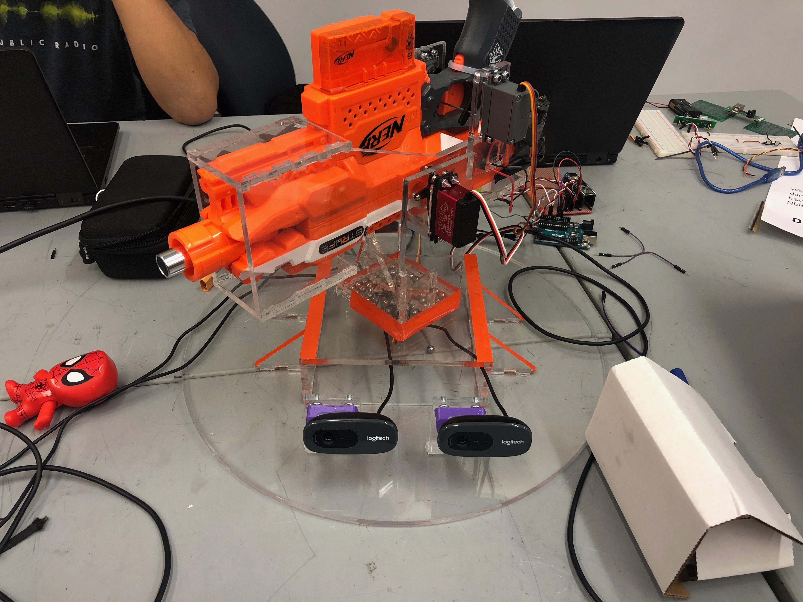

## Software

<iframe width="560" height="315" src="https://www.youtube.com/embed/1G--W59pRZA" frameborder="0" allow="accelerometer; autoplay; encrypted-media; gyroscope; picture-in-picture" allowfullscreen></iframe>

For the final deliverable we were able to get it to function with depth maps independently.
We were able to generate maps with no gaping holes or problems

## Firmware/Electrical

We optimized the connections from the teensy and the arduino to optimize the speed at which the program runs.
The teensy runs faster but the uno can output more power and we optimized the connections to draw enough power while having the commands come from the teensy 3.6 which ran at 180Mhz while the Uno ran at 16Mhz to minimize delay.

## Mechanical

For our final product, we chose to work on improving the function and increasing the aesthetics of the mechanical system. We reoutfitted our mechanism with an upgraded Nerf launcher that featured modifications to its trigger, motor, flywheels, barrel and battery. With the new launcher, the darts were able to fly faster, with higher accuracy and precision which decreased the latency of the entire system. We also added additional circular bearings to reduce the shear on the bearing support for the tilt servo. 

To increase the visual appeal of the total system, we remade everything out of clear acrylic. With the smooth finish and transparent qualities that would expose the inner workings of our system, we believed that acrylic would give our mechanism a slick and elegant look that the MDF did not achieve. Acrylic was chosen as it had similar material properties to the MDF in terms of machinability concerns although additional provisions had to be made for differing chemical properties in terms of assembly. While the acrylic proved to be less forgiving as it is more brittle than MDF, the rigidity improved our stereo vision as the base was less flexible and was affected less by the uneven surface that it was lying on. We also edited some of our designs with visuals in mind such as the circular base. 
