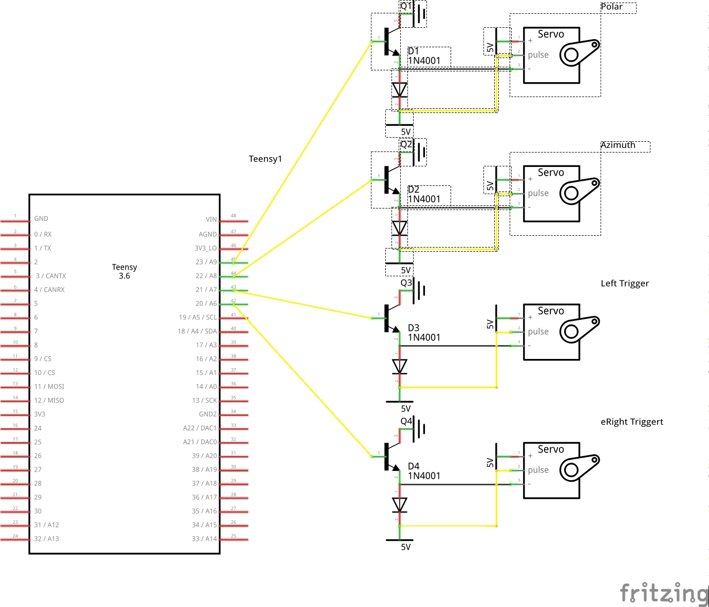
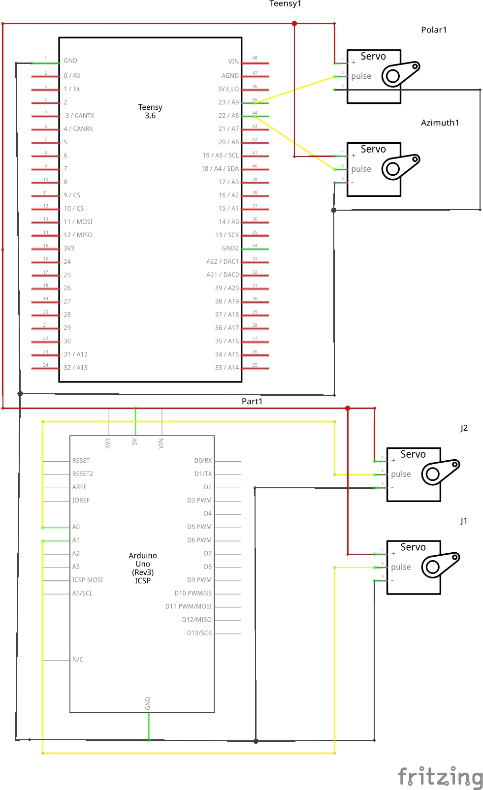
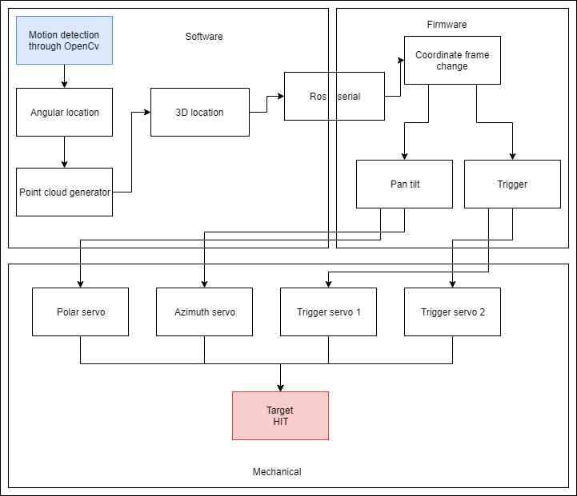

We created a NERF launcher which identifies and targets moving objects in its field of view.
This involves the integration of many systems, which are summarized here.

## Goals

Our project calls for a 3D mapping so that a linear transform can be established from the camera frame of reference to the NERF frame of reference.
We also require a triggering mechanism for the NERF turret as well as a design which would eliminate NERF bullet diversion due to gravity and drag.
These ideas expand to these goals:

- Software
  - Motion Tracking
  - Stereo vision
  - Point cloud processing
  - communication between parts of the software.
  
- Electrical and Firmware
   - Circuit to power high-torque servos
   - Use a faster microcontroller which can handle a continuous stream of aiming and launching information
   - Also a faster microcontroller to handle transforms quickly
   - Prioritize aiming when necessary, and launch only when necessary.
     In other words, work around the single-threaded nature of Arduino.

- Mechanical
  - Eliminate delay in the trigger mechanism
  - Have a rigid setup to support stereo vision.
    It turns out that rigidity is one of the most difficult keys in stereo vision.
  - Create/modify a projectile launcher capable of shooting straight.

## Schematics and Diagrams

We utilized an external circuit to convert 3.3 volt signals to 5 volt signals up to the third sprint.
However, we had an extra Uno, and realized that powering the triggers with an external microcontroller led to better performance.
Therefore, we moved to the circuit diagram on the right which coordinated the two controllers.

## System Diagram

The communication between parts of the system is summarized here.
Data is processed in the software and sent to the firmware.
From this data, the firmware actuates the hardware to achieve our goals.

## Software and Firmware

All of the software is available and under permissive licenses on [GitHub](https://github.com/concaveteam).
Installation instructions, run instructions, and schematics are available there, as well as the source for this site.
