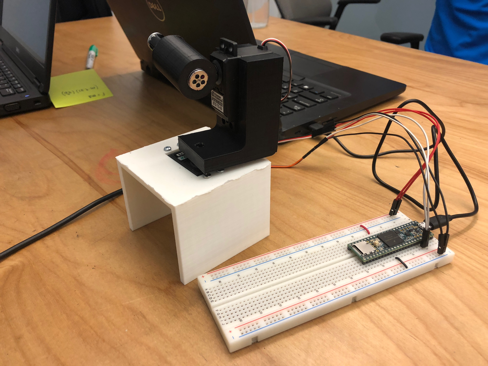

## Software

<iframe width="560" height="315" src="https://www.youtube.com/embed/6PP5_Vex5aE" frameborder="0" allow="accelerometer; autoplay; encrypted-media; gyroscope; picture-in-picture" allowfullscreen></iframe>

For the first sprint we chose to go with OpenCv object detection code which bound all objects in circles and shot at the center of the largest moving one.
It converted the location from image coordinates to spherical coordinates which could then directly be put into the servos.
We ran this on the webcam of our laptop and broadcast the required coordinates on the ROS serial monitor for the firmware to pull from and aim.
The dot follows image coordinates, so the y-axis is inverted in the video.

## Firmware/Electrical

<iframe width="560" height="315" src="https://www.youtube.com/embed/8uvGyRd6DlQ" frameborder="0" allow="accelerometer; autoplay; encrypted-media; gyroscope; picture-in-picture" allowfullscreen></iframe>

The above video demonstrates a proof-of-concept mechanical aiming mechanism and the firmware controlling the hardware.
We used small servos powered by the teensy3.6 microcontroller working with firmware very similar to the one used in Lab 2 but with ability to get information from the ROS serial protocol.
We used the Hobby king Hk-15269 servos to create a pantilt mechanism similar to the one in Lab2 but outfitted with a laser point to show its targeting.
The motors were controlled by a teensy 3.6 which we chose instead of an Uno due to its higher clock speed.
Since they were low power motors they were powered directly from the microcontroller.
The firmware got coordinates from the ROS serial protocol and set the servos to that angle.

## Mechanical

For our first sprint, we chose to create a small model that could be used with the software to track a moving object. Our tracking software had been our greatest risk and we wanted to test the feasibility of such a task before making a fully integrated mechanical system. Our model consisted of a small pan-tilt mechanism that was outfitted with a laser pointer and used servos to give 2-axis movement to the laser pointer. Our software wrote angles to the servo based on the position of the object that it was tracking. This served as a placeholder for the full system in our initial proof of concept for a tracking mechanism. In addition to designing this initial mechanism, we began laying the groundwork for our future larger system by spec’ing out materials and components for the larger scale mechanism. For our MVP, we planned to create a pan-tilt mechanism with a Nerf gun as the projectile launcher. Based on our research, we decided on the Nerf Stryfe as it was easy to modify and had semi-automatic actuation. We also decided on appropriate servos and motors that would be used for the larger pan-tilt system.
