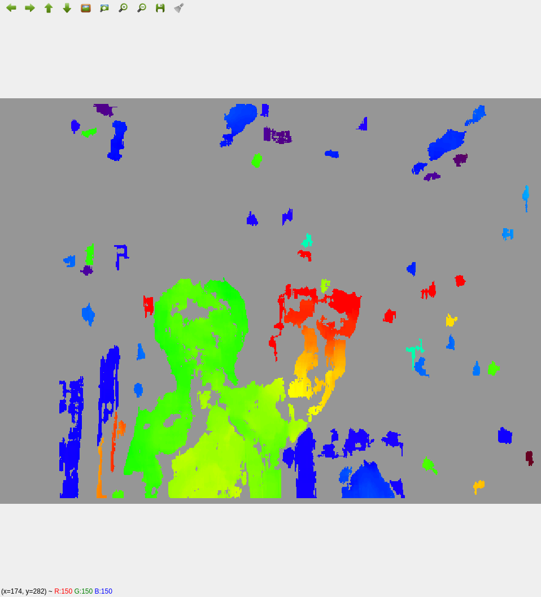
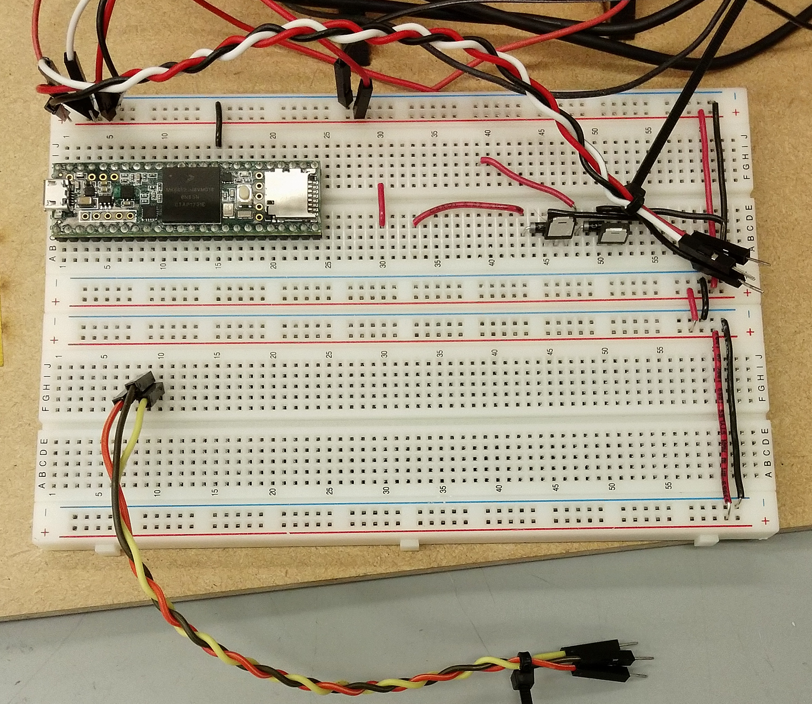
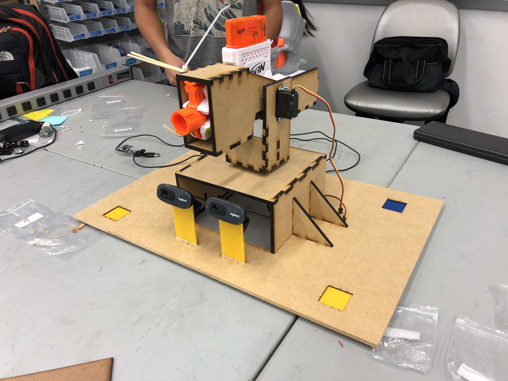

## Software

For the second sprint we tried to generate depth maps from both stereo vision and a single camera using machine learning.
The second method was very computationally expensive and we were unable to get any legitimate results from it.
We were able to generate depth maps from the stereo vision but they were very sparse due to camera mounts being not very rigid and calibration issues.
So we used a setup where we ran the monocular computer vision on both cameras and cross checked before locking on a target.

## Electrical/Firmware

We calculated the mass of the gun and the mounts and estimated the torque required to move the setup by calculating the locations of the COMs. We built an external circuit to power the servos since 3.3v from the teensy 3.6 wasn’t enough to get the motors moving. We also modified the firmware to be able to trigger the gun. In order to optimize communication between the computer and the firmware over ROS, we automatically generated an arduino library to process new types including an aiming type and a trigger type.

## Mechanical

For Sprint 2, as we had validated our ability to track objects, we began full mechanical fabrication of a pan-tilt mechanism with an integrated Nerf gun to work towards achieving our MVP. We designed a base for the entire mechanism as well as mounts that would allow rotation in the pan and tilt directions. To mount the Nerf gun, we designed a holster that hugged the outer contours of the gun and would allow us to easily mount the gun around its center of mass without disturbing the internal mechanisms. We chose to go with laser cutting as the means of fabrication instead of 3D printing as allowed for much faster prototyping and it was actually available to use. For the camera mounts we designed a stand which allowed for multiple angles but then realized they weren’t rigid enough. 
