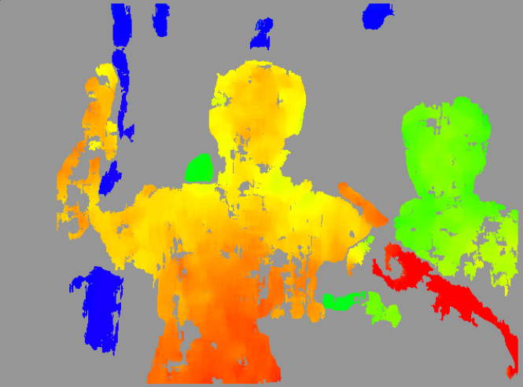
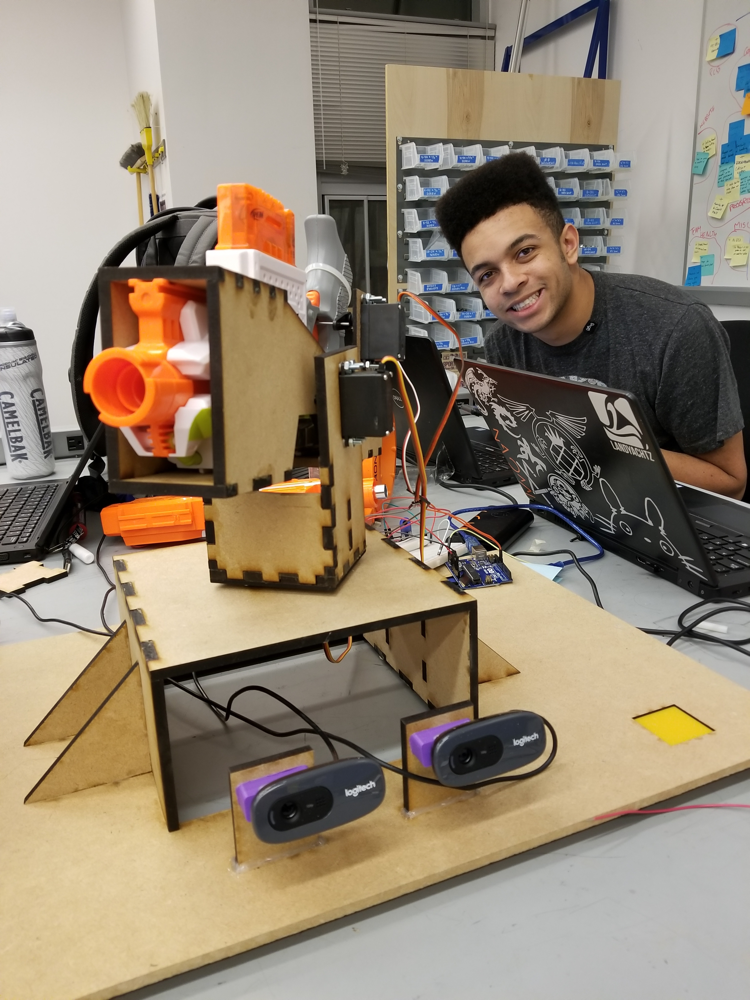

## Software

For the third sprint we were able to generate much better depth maps but they still had a slight amount of noise and switched erratically between multiple moving objects.
So we had a backup code which relied on trigonometry to estimate the distance between the detected object and the cameras.
The legacy code for the triangulation system exists in the software's `ssreekanth2000-patch-1` branch on `src/TrackMono/TrackMono.cpp`.

## Firmware/Electrical

<iframe width="560" height="315" src="https://www.youtube.com/embed/zrE_tocqXjA" frameborder="0" allow="accelerometer; autoplay; encrypted-media; gyroscope; picture-in-picture" allowfullscreen></iframe>

We had to change the trigger mechanism to facilitate the new design with servos.
Rather than a subscription model which our aiming mechanism used, we use a service which pulls the trigger on a signal, returning a completion status.
The above video demonstrates shooting Julian as he moves around.
Internally, we use a service rather than a subscription to control the trigger, cluttering the serial communication less.

## Mechanical

For Sprint 3, we moved towards turning out a minimal viable product (MVP), designing and fabricating additional components to complete our Sprint 2 design. The first of these components was the trigger actuation system for the Nerf launcher. As we wanted for our final product to be fully autonomous, we needed an integrated mechanism to replace the manual actuation method used for testing during Sprint 2. We decided to use two servos mounted opposite each other with servo horns connected by spring wire. Appropriate angles would be written to the servos, causing the spring wire to depress the trigger and firing a dart. We also addressed the instabilities about the axes of rotation within our mechanism. As each direction’s motion was controlled by a single servo, our mounting was often supported on only one side and as a result our mounts were cantilevered. For our pan rotation, the mount attached to the servo was unsupported at the rectangular edges making it very unstable. To rectify this, we implemented a lazy-susan style rotary table by enclosing free-moving bearing balls between the top of the base and the bottom of the attached U-mount which supported the Nerf launcher and its holster. The ball bearings were able to support the weight applied at the corners of the U-mount without restricting the rotational movement. To fix the cantilevering of the holster mounted to the tilt servo, we incorporated circular bearings that supported the holster on the end opposite to the servo while retaining the freedom of rotation. We also redesigned the camera mounts to be more rigid, sacrificing adjustability with a single set angle. 
